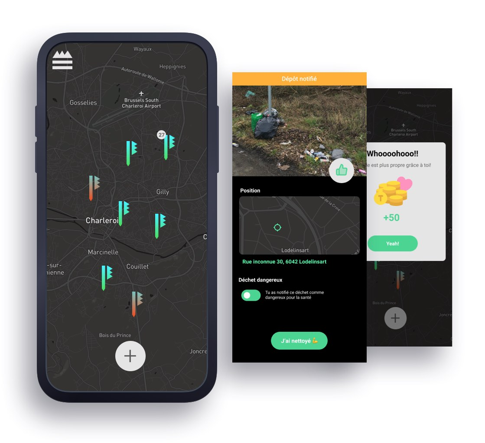

<div align="center">
    
    <h1>Trashmaster Native App</h1>
</div>

<h4 align="center">Signale, confirme, nettoye, change le monde</h4>

<div align="center">
  
  
</div>

<br />

---

<div align="center">
  
</div>

---

## 👀 Overview <!-- omit in toc -->

- [📱 Prototypes](#-prototypes)
- [🏗 Installation](#-installation)
- [🔍 What's inside](#-whats-inside)
- [📚 Documentation](#-documentation)
- [🙌 Contributions](#-contributions)
  - [Repository rules](#repository-rules)

## 📱 Prototypes

You can already navigate through the early first prototypes [here](https://www.figma.com/proto/BBaugjhYsSMU8dTrc1MgpN/wireframes?node-id=40%3A843&viewport=332%2C-124%2C0.4580148756504059&scaling=min-zoom).

## 🏗 Installation

Run the following commands:

```sh
# Clone the repo
git clone ... && cd ...

# Install dependencies
https://reactnative.dev/docs/0.61/getting-started
brew install node
brew install watchman

# Run on ios or android
npm run ios / npm run android
```

## 🔍 What's inside

- **RN 0.63.3**
- **Expo Free**
- **Libs**: React Hooks 💪
- **Language**: [Pure JavaScript ESNext](https://www.ecma-international.org/ecma-262/#sec-intro) ➡️ TypeScript soon ❤️ (On going migration)
- **Store**
  - React Redux
  - Redux Saga (side effects)
- **Router**: React Navigation
- **Loadings** [React Native Loading Spinner Overlay](https://github.com/joinspontaneous/react-native-loading-spinner-overlay) (sub dependencies ✅)
- **Http**: [Axios](https://github.com/axios/axios) (soon)
- **Forms**: [React Hook Form](https://react-hook-form.com)
- **Icons**: [Icon vectors](https://github.com/oblador/react-native-vector-icons#bundled-icon-sets)

## 📚 Documentation

[Follow me.](docs/general.md)

## 🙌 Contributions

Feel free to contact us on Discord (badge on top) or through [Instagram](https://www.instagram.com/trashmaster_be/) | [facebook](https://www.facebook.com/Trashmaster-592354701141792) so that we can give you an access to our **Confluence wiki**.

### Repository rules

- **Code style**: Prettier + Linter.
- **Commits**: Please follow the [Angular commit convention](https://github.com/angular/angular/blob/master/CONTRIBUTING.md).
- **Branching**: Please add changes to an up to date personal feature branch. If you are ahead of some commits from the main branch, please **rebase**.
